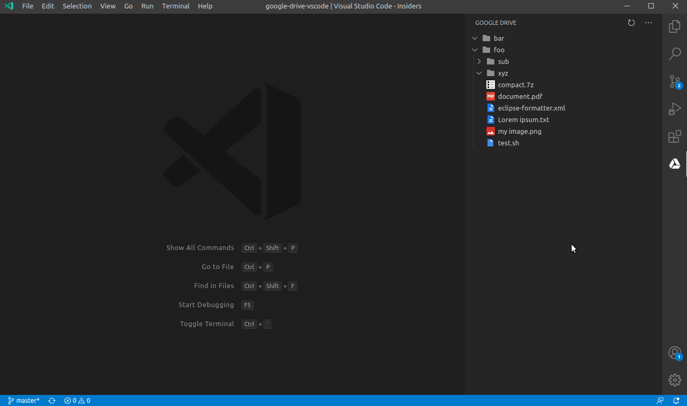
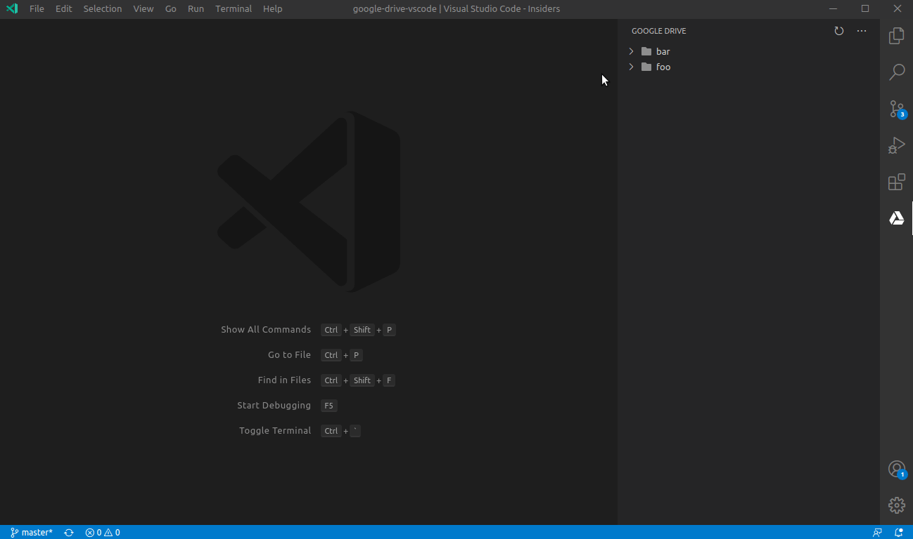
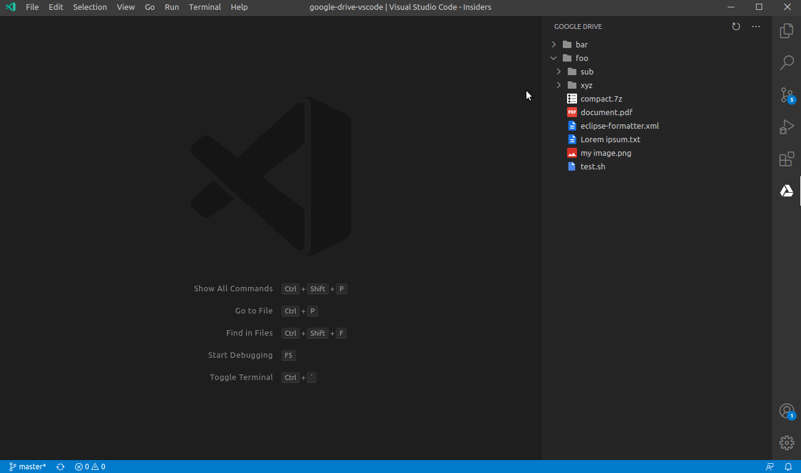
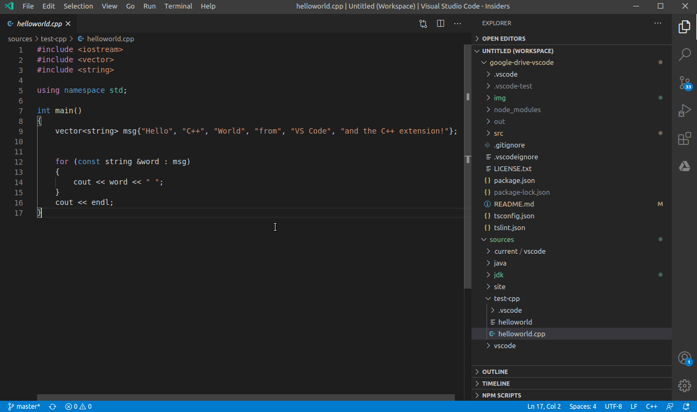
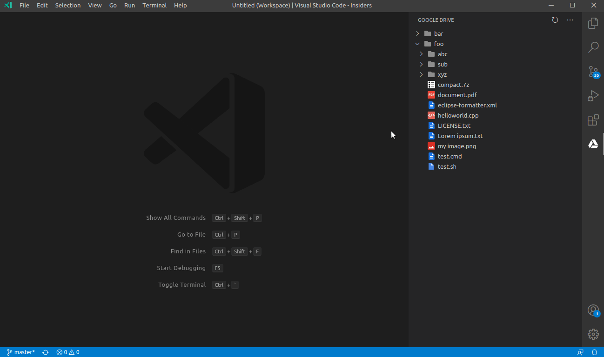
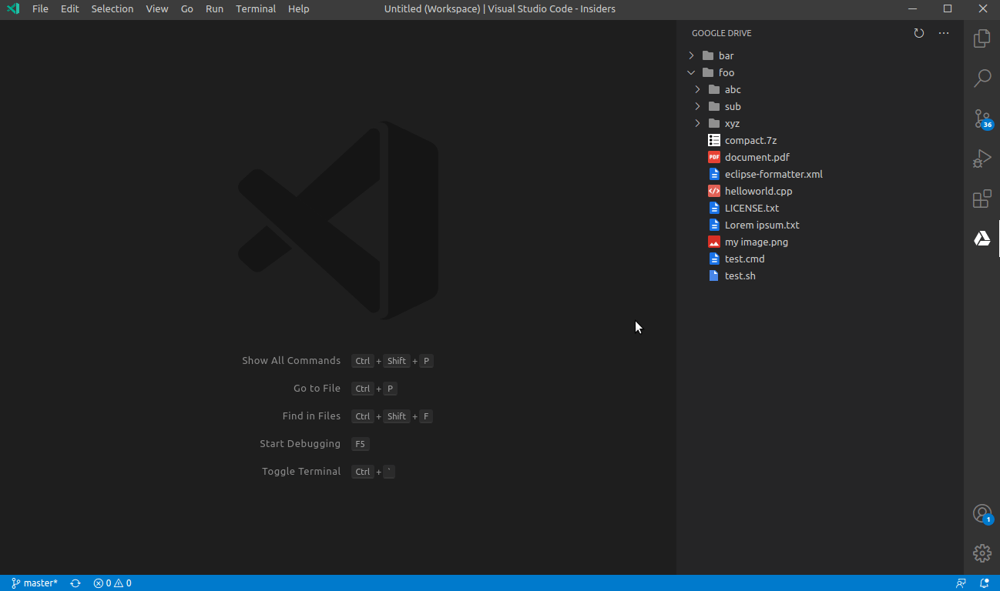

# Google Drive™ for VSCode

Manage Google Drive™ files and folders directly from VSCode. This extension uses *drive.file* scope and then can only access files and folders created on Google Drive™ through this extension. It will soon allow you to provide access to other files on Google Drive™ using Google Picker API (to be implemented).

## Features
   
### File content preview
You can preview file content directly from VSCode using your favorite theme. This way you don't need to download file to disk 
and you are able to take a look at the file in a fast way.

### Navigation
Feel free to navigate through your remote files and folders in a tree structure, which is available on the *Google Drive™* View located on the Side Bar.

### Create folders

You can create folders on Google Drive™ from the same Tree View used to navigate through remote files and folders. Just right-click a folder on Drive Tree View and select *Google Drive: Create folder on Drive*, and specify the folder name. This will create a subfolder for the one which has been selected on Tree View.

### Upload files

You can upload files in three different ways.

1. **Selecting specific file on workspace:** right-click a file on your workspace and select the option *Google Drive: Upload selected file to Drive*. You will be asked for the destination folder where you wish to upload/place your file on Drive.

2. **Upload file currently open in the editor:** open the Command Palette and select *Google Drive: Upload current file to Drive*. You will also be asked for the destination folder where you wish to upload the current file.

3. **Drive Tree View:** right-click a folder on Drive Tree View and select the option *Google Drive: Upload file to selected folder on Drive*. You will be asked for the file you wish to upload.

### Download
You can download files to your computer in a similar way you are used to do through your browser. From the Drive Tree View, just right-click the file you wish to download and select *Google Drive: Download file from Drive*, and you will be asked for the local destination folder.

### Rename
Rename selected files and folders from the Tree View. Just right-click the file or folder you wish to rename and select *Google Drive: Rename file on Drive*, and specify the new name on the input box.

## Requirements
In order to use this extension you need to set up Google Drive™ API on your Google account.

   * Access [this link](https://developers.google.com/drive/api/v3/quickstart/nodejs) to turn on the Drive API
   * Click on *Enable the Drive API* button
   * On the modal pop-up, make sure you have *Desktop app* selected
   * Click *Create*
   * Click *Download client configuration*
   
Once you have *credentials.json* file, access Command Palette on VSCode and run the command: *Google Drive: Configure credentials*, and select the *credentials.json* file.

## Next features
The next features will be developed soon:
   - **Select** files with Google Picker API, so one can authorize access to files created by other apps or files which have been manually uploaded to Google Drive™
   - **Delete** files

## Known issues
   * On versions smaller than v1.48 (Insiders), the file preview does not properly preview binary data e.g. image files. v1.48 will soon be the minimum version to run this extension. 

## Trademark
Google Drive is a trademark of Google Inc. Use of this trademark is subject to Google Permissions.