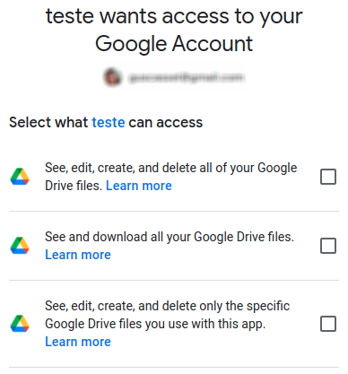
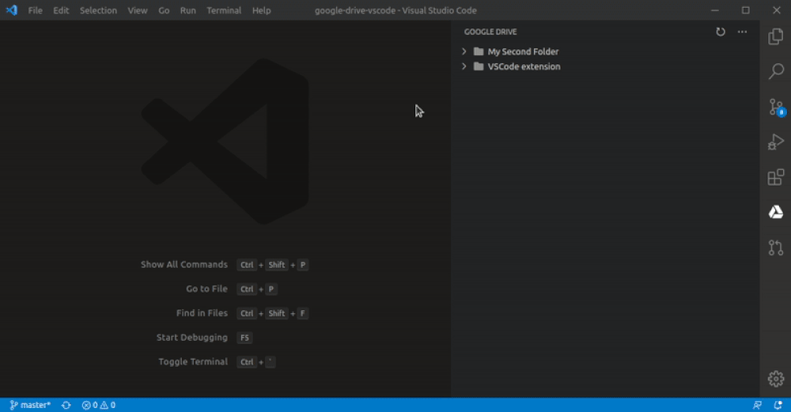
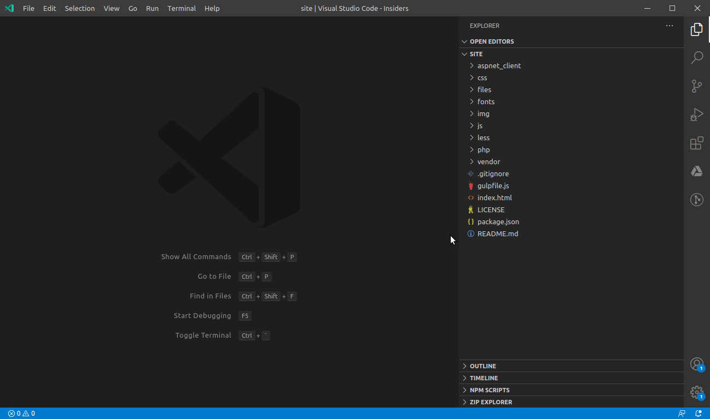

**This is NOT an official extension. This extension is NOT developed by Google.**

**THE EXTENSION AUTHORS ARE NOT RESPONSIBLE FOR ANY DAMAGE, PROBLEM, DATA LOSS OR ANY OTHER KIND OF PROBLEM THAT CAN BE CAUSED BY USING THIS EXTENSION. USE THIS EXTENSION BY YOUR OWN RISK.**

# Google Drive™ for VSCode

1. [Overview](#google-drive-for-vscode)
2. [Features](#features)
    1. [File content preview](#file-content-preview)
    2. [Copy URL to clipboard](#copy-url-to-clipboard)
    3. [Navigation](#navigation)
    4. [Create folders](#create-folders)
    5. [Upload zipped Workspace](#upload-zipped-workspace)
    6. [Upload files](#upload-files)
    7. [Download](#download)
    8. [Rename](#rename)
3. [Setup](#setup)
4. [Known issues](#known-issues)
5. [Trademark](#trademark)

Manage Google Drive™ files and folders directly from VSCode.

This extension can work with the following scopes (access levels to Drive API files and folders). These scopes tell what resources the extension can access from your Google account:
   - **drive** - grants access to all files and folders on Drive. There are some limitations regarding folder shortcuts and specific Google formats (check known issues at the end of this README);
   - **drive.readonly** - grants read-only access to all files and folders on Drive. While using this scope, you cannot upload, rename, among other operations rather than listing and reading files. There are some limitations regarding folder shortcuts and specific Google formats (check known issues at the end of this README);
   - **drive.file** - only accesses files and folders created on Drive through this extension. With this scope, you WILL NOT be able to access all existing files that you have on Drive and that were uploaded through other tools, such as the Google Drive website itself. This scope only allows you to access files uploaded to Drive through this VSCode extension.

Please refer to [this documentation](https://developers.google.com/drive/api/v3/about-auth) to get more information about scopes. 

We recommend that you only select the access level/scope that you really need, instead of simply choosing the *drive* scope to grant full read and write access to all of your files, in case you do not need this huge access level.

You can also select more than a single scope in order to merge access levels. For example, you can select *drive.readonly* to list and read all data, and *drive.file* to upload files. It is interesting because it will not allow to modify existing data that has been previously uploaded to Drive through other tools, such as the Drive website.

The scope is chosen when granting access to your Google account, as follows:

## Features
   
### File content preview
You can preview file content directly from VSCode using your favorite theme. This way you don't need to download file to disk 
and you are able to take a look at the file in a fast way.

   
### Copy URL to clipboard
In case you prefer to view the file or folder content in the web browser itself, you can copy the URL to the clipboard through the context menu.

### Navigation
Feel free to navigate through your remote files and folders in a tree structure, which is available on the *Google Drive™* View located on the Side Bar.

### Create folders

You can create folders on Google Drive™ from the same Tree View used to navigate through remote files and folders. Just right-click a folder on Drive Tree View and select *Google Drive: Create folder on Drive*, and specify the folder name. This will create a subfolder for the one which has been selected on Tree View.

### Upload zipped Workspace

This extension provides the command: *Google Drive: Upload Workspace to Drive*, which zips the entire Workspace into a single .zip file with date and time as part of the name. If you have a multi-root Workspace, only the first root will be zipped and uploaded.

### Upload files

You can upload files in three different ways.

1. **Selecting specific file on workspace:** right-click a file on your workspace and select the option *Google Drive: Upload selected file to Drive*. You will be asked for the destination folder where you wish to upload/place your file on Drive.

2. **Upload file currently open in the editor:** open the Command Palette and select *Google Drive: Upload current file to Drive*. You will also be asked for the destination folder where you wish to upload the current file.

3. **Drive Tree View:** right-click a folder on Drive Tree View and select the option *Google Drive: Upload file to selected folder on Drive*. You will be asked for the file you wish to upload.

### Download
You can download files to your computer in a similar way you are used to do through your browser. From the Drive Tree View, just right-click the file you wish to download and select *Google Drive: Download file from Drive*, and you will be asked for the local destination folder.

### Rename
Rename selected files and folders from the Tree View. Just right-click the file or folder you wish to rename and select *Google Drive: Rename file on Drive*, and specify the new name on the input box.

## Setup
In order to use this extension you need to set up the Drive™ API on your Google account.  
Checkout the detailed [step-by-step guide](./setup-guide/setup-guide.md)

In case you have any problem with these steps, feel free to open an issue and ask for help. This way we can improve it and make it easier for other users. In addition, feel free to create a PR in case you wish to help improve this README.

## Known issues
   * When using *drive* or *drive.readonly* scope (that allows access to all files on Drive) you still cannot:
      - Open folders that in fact are shortcuts to other folders;
      - Download files with specific Google formats, such as those files related to Google Docs, Sheets, Slides, among others.

If you find any security problem, please send an email to guscassel@gmail.com instead of opening a public issue on GitHub.

## Trademark
Google Drive is a trademark of Google Inc. Use of this trademark is subject to Google Permissions.
