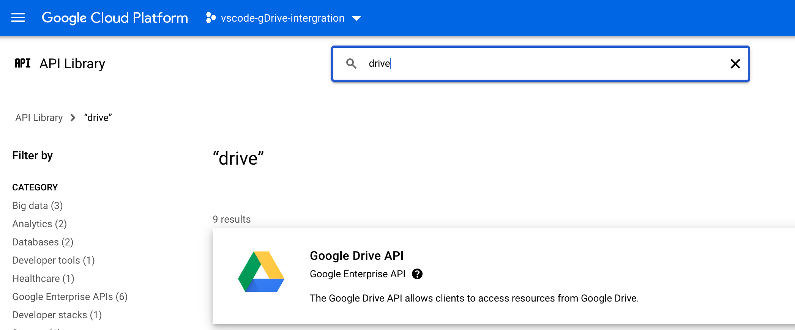
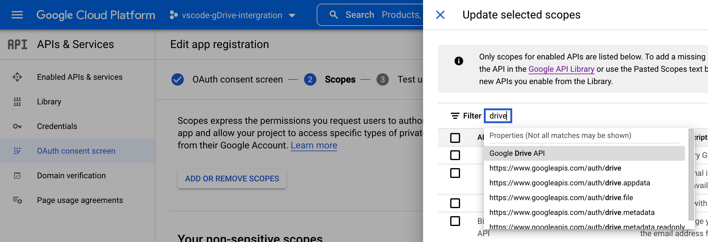
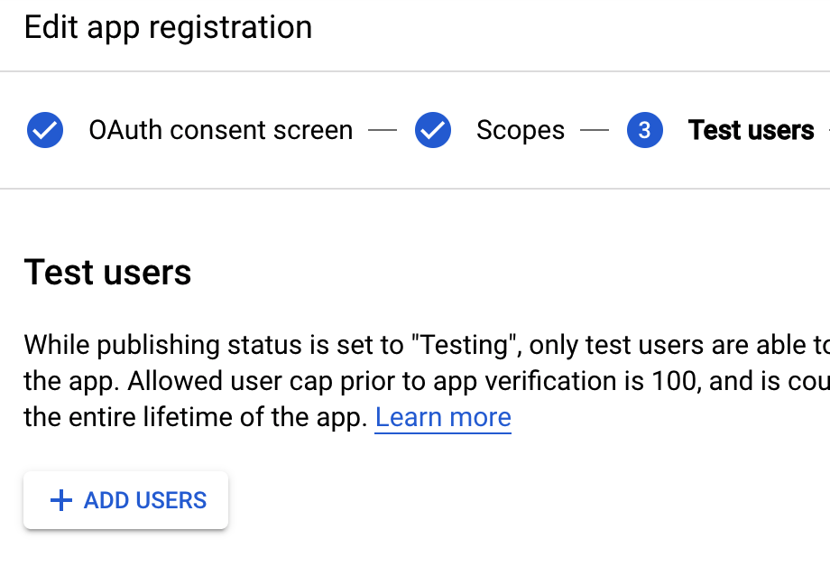
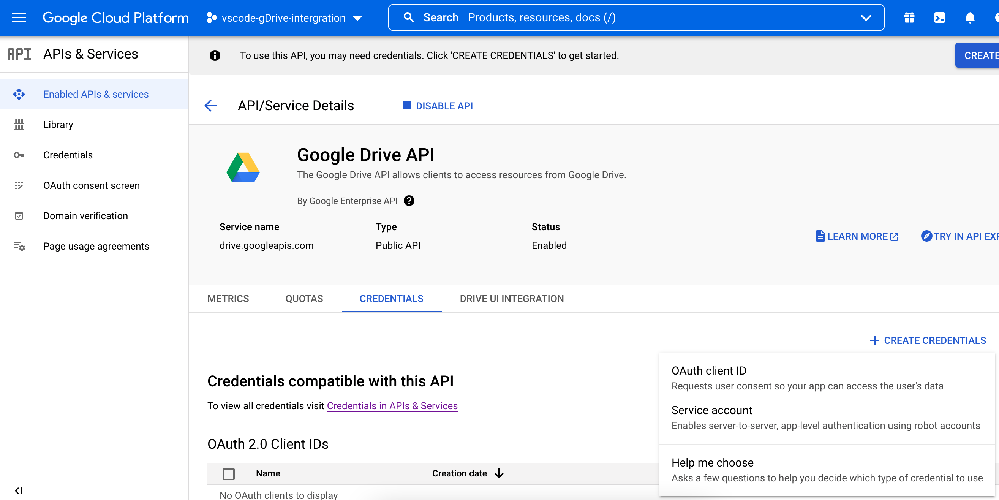
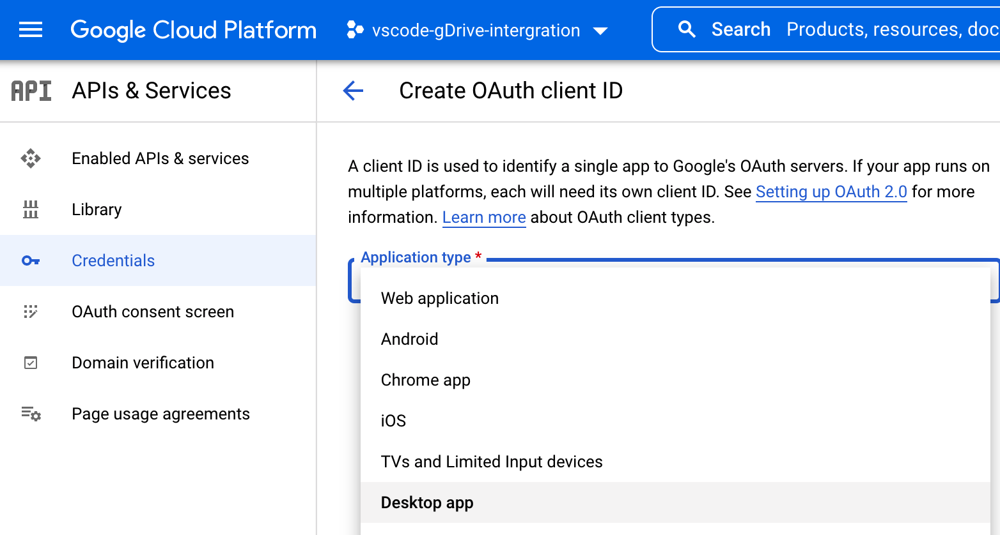
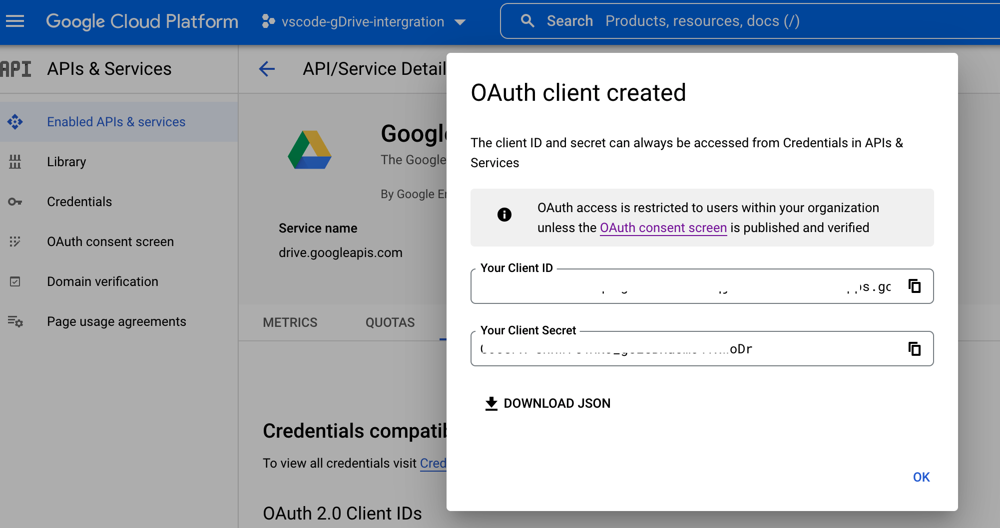
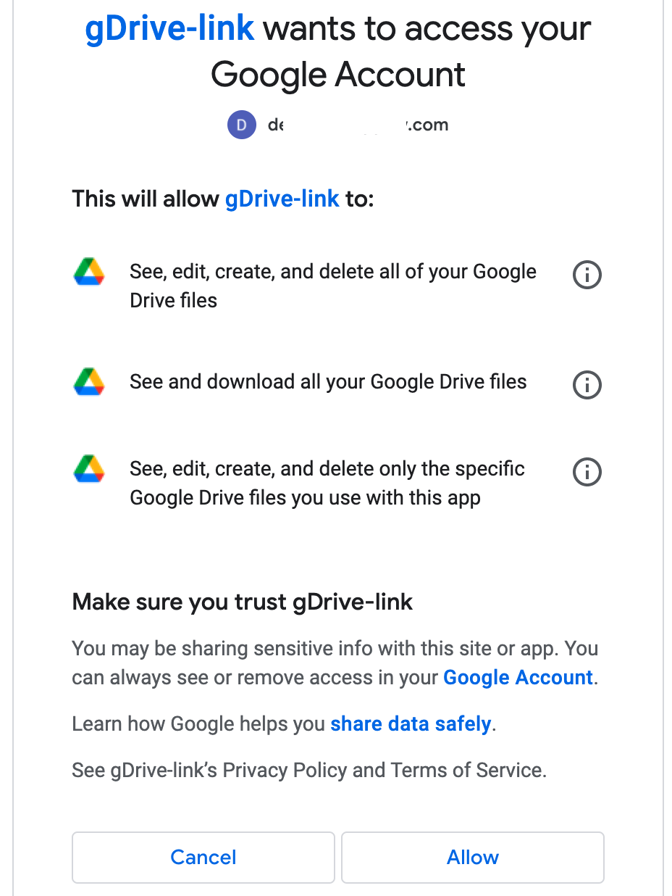

# Setting up Google Drive™ for VSCode

## Overview
The whole process consists of 5 high-level steps:  
On Google Cloud Console:  
1. Create a project on Google Could Platform  
2. Enable Google Drive API  
3. Setup OAuth consent screen so you can grant permissions required by this extensions  
4. Create and download OAuth credentials-json  

In VSCode:  
5. Provide credentials-json to this extension within VSCode


## Step-by-step
1. Create new project `${your-project-name}` on Google Cloud Platform: [](https://console.cloud.google.com)

1. Header --> Side menu --> `APIs & Services`

1. `APIs & Services`.SideMenu --> Library. 

1. Search for `Google Drive API`, select from the search results and click `Enable`.  
    

1. `APIs & Services`.SideMenu --> `OAuth consent screen`. Go through step-by-step process there. On the `scopes` step click `Add or remove scopes` and filter by `Google Drive API`:  
      

1. Choose few specific scopes:  
    * `.../auth/drive.file`
    * `.../auth/drive.readonly`  
    
    ```
    WARNING: `.../auth/drive` scope will provide the extension with unlimited access to your files. Use with caution.
    ```

1. If you want to access your personal google-drive (...@gmail.com) and not using an account of some organization (`...@custom-company.com`), then you need to mark your app as an `External` and add your email on the `Test users` step:  


1. `APIs & Services`.SideMenu --> Enabled APIs & services, at the bottom of the page see the table of the services --> click on `Google Drive API`. It should navigate you to the page:  

    https://console.cloud.google.com/apis/api/drive.googleapis.com/metrics?project=`${your-project-name}`

1. See `Credentials` tab a bit below the header, click `+ Create Credentials` to the right of the page, select `OAuth Client ID`  


1. Select `Desktop app` and complete the rest few fields   


1. Once you see `OAuth client created` popup, click on `Download JSON`  


1. Return to VSCode, open command palette, run `google.drive.configureCredentials` command and select path to the downloaded JSON  

1. Reload VSCode (run `Reload window` command) and click on `Drive` plugin icon on the side bar. You should be automatically navigated to your web-browser where you should see the OAuth consent popup:  
    
    ```
    WARNING: You may see a warning-popup prior to the actual consent popup saying that you have to trust a developer of that extension. Please inspect the source code to make sure you privacy is not corrupted.
    ```

    This is an example of a popup that you see in case you setup an app constraint to some organization (i. e. accessed from corporate emails `...@custom-company.com`)
  

We're done! Happy browsing your Drive files ;)
